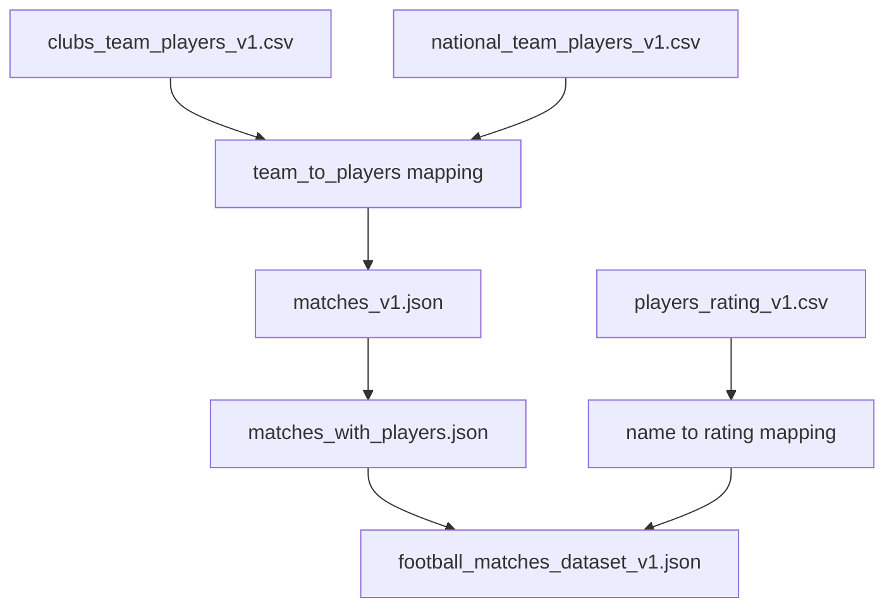

# 30 Days ML Challenge (Beakinto Data)
---
# Football Goals Prediction Model

## Overview

This project focuses on building a predictive model to forecast the number of goals scored by each team in a football match. The model incorporates various data sources, including player ratings and team information, to create a robust prediction system. The process involves data collection, preprocessing, feature engineering, exploratory data analysis (EDA), model training, and deployment.

## Table of Contents

1. [Data Collection](#data-collection)
2. [Preprocessing](#preprocessing)
3. [Data Cleaning](#data-cleaning)
4. [Exploratory Data Analysis (EDA)](#exploratory-data-analysis-eda)
5. [Model Training](#model-training)
6. [API Development with Flask](#api-development-with-flask)
7. [Dockerization](#dockerization)
8. [Deployment on Azure](#deployment-on-azure)

## 01. Data Collection

### Source
Data was collected using Scrapy from [Transfermarkt](https://www.transfermarkt.com/).

### Datasets
The following datasets were collected:
- `clubs_team_players_v1.json`
- `national_team_players_v1.json`
- `matches_v1.json`
- `players_rating_v1.csv`

## 02. Preprocessing

The preprocessing stage involves reading the collected data, normalizing team and player names, and mapping players to their respective teams. This step ensures consistency and prepares the data for further analysis.

### How is the process of Mapping conducted


## 03. Data Cleaning Strategy
The data cleaning stage involves handling missing values and ensuring the integrity of the data. This includes:

- Handling missing values by imputing the mean rating for missing player ratings.

# 04. Exploratory Data Analysis (EDA)

| Top 10 Teams with the Most Players |Home Team vs. Away Team Average Rating |
|:---------------------------------:|:------------------------------:|
| |  |

| Top 10 Players by Frequency of Appearances | Home Team vs Away Team Scores |
|:-----------------------------------------:|:---------------------------------:|
|  |  

| Home Team Score vs. Home Team Average Rating | Away Team Score vs. Away Team Average Rating |
|:-------------------------------------------:|:-------------------------------------------:|
|  |  |

| Number of Home vs Away Team Players |
|:-------------------------------:|
| 

## 05. Model Training
- We use a `RandomForestRegressor` for prediction due to its robustness and ability to handle multiple output variables efficiently when wrapped in a `MultiOutputRegressor`.
- Hyperparameters are optimized using RandomizedSearchCV with a predefined parameter distribution and cross-validation
- 
### Model Evaluation
  The model is evaluated using several metrics:
- Mean Absolute Error (MAE): `1.14`
- Mean Squared Error (MSE): `2.4`
- Root Mean Squared Error (RMSE): `1.5`

## 06. API Development with Flask
An API is developed using Flask to serve the model predictions. The API allows users to input both teams name and receive predicted scores.

## 07. Dockerization
The application is containerized using Docker to ensure consistency across different environments. A Dockerfile is created to define the environment and dependencies.

## 08. Deployment on Azure
The Docker container is deployed on Azure, making the model accessible as an api. Azure provides scalability and reliability for the deployed model.


# Final Results:
### Football Goals Prediction API 

 The Football Goals Prediction API provides predictions for football goals based on various data inputs. Below are the details on how to use the API.

## Base URL
The base URL for accessing the API is:
`http://footballgoalspredictionapi.f6cpcjeweuhgacfm.eastus.azurecontainer.io`

## Endpoints

### 1. Get Prediction
  **Endpoint**: `/predict`
  
  **Method**: `POST`
  
  **Description**: This endpoint provides a prediction for football goals based on the provided query parameters.
  
  **Query Parameters**:
  - `home_team`: Name of the home team (string, required)
  - `away_team`: Name of the away team (string, required)
  
  #### **Example Request**:
  Using `curl` command
  ```sh
  curl "http://footballgoalspredictionapi.f6cpcjeweuhgacfm.eastus.azurecontainer.io/predict?home_team=Ac%20Milan&away_team=atalanta%20bc"
  ```
  #### **Example Response:**
  
  ```json
  {
      "home_team": "Ac Milan",
      "away_team": "atalanta bc",
      "predicted_home_goals": 4,
      "predicted_away_goals": 3
  }
  ```
  
  - **Using Python `requests` lib**
  ```python
  import requests
  
  url = "http://footballgoalspredictionapi.f6cpcjeweuhgacfm.eastus.azurecontainer.io/predict"
  params = {
      "home_team": "Ac Milan",
      "away_team": "atalanta bc"
  }
  response = requests.post(url, params=params)
  print(response.json())
  
  ```
  
  - **Using JavaScript `fetch` API**
  ```javascript
  fetch('http://footballgoalspredictionapi.f6cpcjeweuhgacfm.eastus.azurecontainer.io/predict?home_team=Ac%20Milan&away_team=atalanta%20bc')
    .then(response => response.json())
    .then(data => console.log(data))
    .catch(error => console.error('Error:', error));
  ```
  
  - **Using Java `HttpClient`**
  ```java
  import java.net.http.HttpClient;
  import java.net.http.HttpRequest;
  import java.net.http.HttpResponse;
  import java.net.URI;
  
  public class ApiClient {
      public static void main(String[] args) throws Exception {
          HttpClient client = HttpClient.newHttpClient();
          HttpRequest request = HttpRequest.newBuilder()
                  .uri(URI.create("http://footballgoalspredictionapi.f6cpcjeweuhgacfm.eastus.azurecontainer.io/predict?home_team=Ac%20Milan&away_team=atalanta%20bc"))
                  .build();
  
          HttpResponse<String> response = client.send(request, HttpResponse.BodyHandlers.ofString());
          System.out.println(response.body());
      }
  }
  ```
  
  ---
