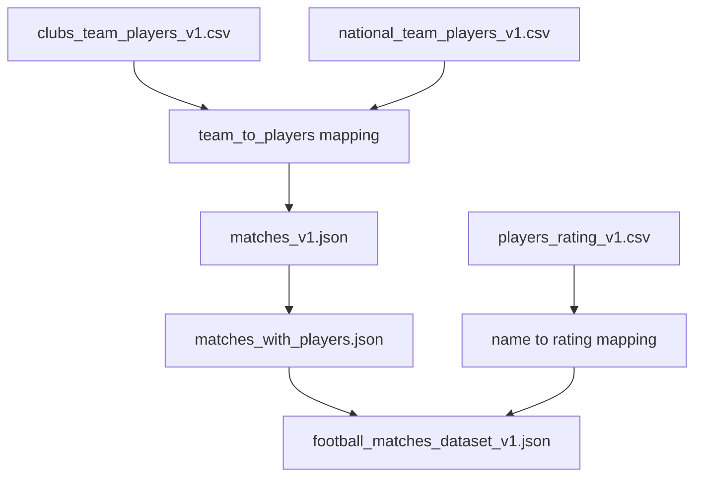

# Football Goals Prediction Model

## Overview

This project focuses on building a predictive model to forecast the number of goals scored by each team in a football match. The model incorporates various data sources, including player ratings and team information, to create a robust prediction system. The process involves data collection, preprocessing, feature engineering, exploratory data analysis (EDA), model training, and deployment.

## Table of Contents

1. [Data Collection](#data-collection)
2. [Preprocessing](#preprocessing)
3. [Data Cleaning](#data-cleaning)
4. [Exploratory Data Analysis (EDA)](#exploratory-data-analysis-eda)
5. [Model Training](#model-training)
6. [API Development with Flask](#api-development-with-flask)
7. [Dockerization](#dockerization)
8. [Deployment on Azure](#deployment-on-azure)

## Data Collection

### Source
Data was collected using Scrapy from [Transfermarkt](https://www.transfermarkt.com/).

### Datasets
The following datasets were collected:
- `clubs_team_players_v1.json`
- `national_team_players_v1.json`
- `matches_v1.json`
- `players_rating_v1.csv`

## Preprocessing

### Summary
The preprocessing stage involves reading the collected data, normalizing team and player names, and mapping players to their respective teams. This step ensures consistency and prepares the data for further analysis.

### Flow Chart

# Data Cleaning Strategy
The data cleaning stage involves handling missing values and ensuring the integrity of the data. This includes:

- Handling missing values by imputing the mean rating for missing player ratings.
- Ensuring all necessary fields are populated and correctly formatted.

# Exploratory Data Analysis (EDA)

| Top 10 Teams with the Most Players | Number of Home vs. Away Players |
|:---------------------------------:|:------------------------------:|
|  |  |

| Top 10 Players by Frequency of Appearances | Distribution of Home Team Scores |
|:-----------------------------------------:|:---------------------------------:|
|  |  |

| Distribution of Away Team Scores | Distribution of Home Team Average Ratings |
|:-------------------------------:|:------------------------------------------:|
|  |  |

| Home Team Score vs. Home Team Average Rating | Away Team Score vs. Away Team Average Rating |
|:-------------------------------------------:|:-------------------------------------------:|
|  |  |

# Model Training
The model training stage involves splitting the data into training and testing sets, selecting a model, and optimizing its hyperparameters.

## Summary
- The dataset is split into training and testing sets.
- A `RandomForestRegressor` is used for prediction.
- Hyperparameters are optimized using `RandomizedSearchCV`.

# API Development with Flask
An API is developed using Flask to serve the model predictions. The API allows users to input match details and receive predicted scores.

# Dockerization
The application is containerized using Docker to ensure consistency across different environments. A Dockerfile is created to define the environment and dependencies.

# Deployment on Azure
The Docker container is deployed on Azure, making the model accessible as a web service. Azure provides scalability and reliability for the deployed model.

